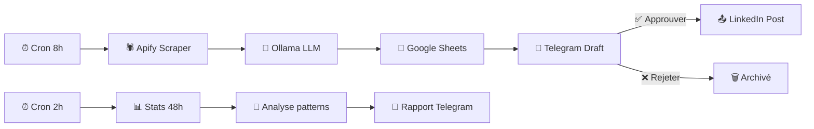

# 📱 LinkedIn Content Factory — n8n

Pipeline automatisé de création et publication de contenu LinkedIn. De la veille concurrentielle à la publication, en passant par la génération IA et l'approbation humaine.

## 🏗️ Pipeline

## 📋 Workflows (3)

| Workflow | Déclencheur | Description |
|----------|------------|-------------|
| 01 — Scrape & Generate | Cron 8h00 | Scraping Apify + génération IA + stockage Sheets |
| 02 — Approval Bot | Telegram callback | Approbation/rejet et publication LinkedIn |
| 03 — Feedback 48h | Cron toutes 2h | Collecte stats et analyse des performances |

## 🛠️ Stack

- **Orchestration** : n8n self-hosted
- **Scraping** : Apify (posts LinkedIn viraux)
- **IA** : Ollama local (génération de contenu)
- **Stockage** : Google Sheets (2 onglets : ViralPosts / GeneratedPosts)
- **Approbation** : Telegram Bot
- **Publication** : LinkedIn OAuth2

## ⚙️ Configuration

Variables n8n requises :
- `APIFY_TOKEN` — token Apify pour le scraping
- `LINKEDIN_PERSON_URN` — ton URN LinkedIn (urn:li:person:xxx)
- `TELEGRAM_BOT_TOKEN` — token du bot Telegram
- `TELEGRAM_CHAT_ID` — ton chat ID Telegram

Google Sheets : créer un fichier avec 2 onglets `ViralPosts` et `GeneratedPosts`.

## 📸 Captures d'écran

> *Screenshots à venir — bot Telegram d'approbation, exemple de post généré*

## ⚖️ Avertissement légal

Le scraping de LinkedIn via Apify utilise une API tierce qui collecte des données publiques. Cette pratique est dans une **zone grise des CGU LinkedIn** (voir l'arrêt *hiQ Labs v. LinkedIn*, 2022). 

Ce projet est fourni **à des fins éducatives et d'usage personnel**. L'utilisateur est seul responsable du respect des conditions d'utilisation de LinkedIn et de la législation applicable (RGPD, etc.). Il est recommandé de :
- Scraper uniquement des posts publics
- Ne pas automatiser à grande échelle
- Vérifier les CGU LinkedIn et Apify régulièrement

## 🚀 Import dans n8n

1. Dans n8n → **Workflows** → **Import**
2. Importer les 3 JSON du dossier `workflows/` dans l'ordre (01 → 02 → 03)
3. Configurer les credentials : Google Sheets, LinkedIn OAuth2, Telegram
4. Créer les variables n8n listées ci-dessus
5. Activer les workflows
